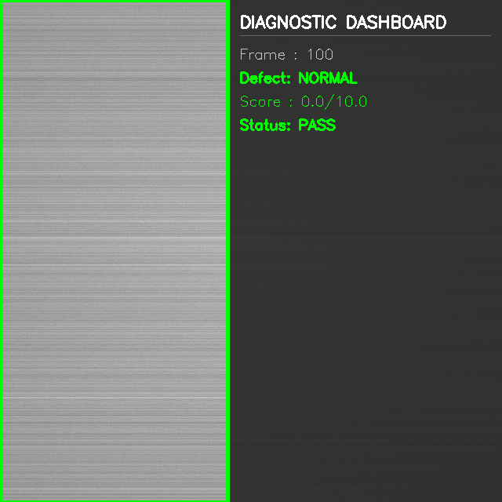
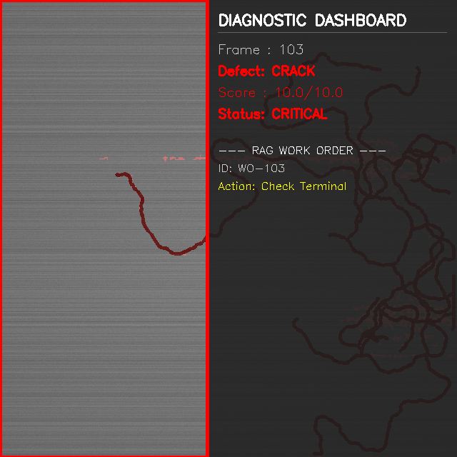
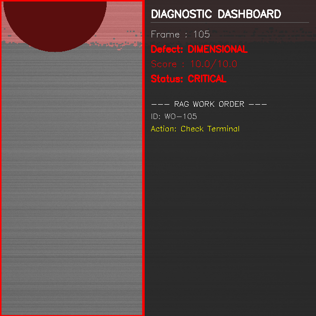

# Industrial Vision & Diagnostic RAG Platform

> An end-to-end AI system that detects surface defects on industrial metal components using Computer Vision and Machine Learning, then automatically generates actionable maintenance work orders using an Agentic RAG (Retrieval-Augmented Generation) pipeline powered by LangGraph.

---

## Screenshots

### PASS — Normal Metal Component (Green Border)
<!-- Replace the line below with your actual screenshot after uploading it to GitHub -->


> Frame 100: The system correctly identifies a clean, defect-free metal surface. The green border and PASS status confirm no maintenance action is needed.

---

### CRITICAL — Crack Detected (Red Border + RAG Work Order)
<!-- Replace the line below with your actual screenshot after uploading it to GitHub -->


> Frame 103: A branching structural crack is detected at severity 10.0/10.0. The red border triggers automatically, and the LangGraph RAG agent immediately generates Work Order WO-103 with GTAW welding repair steps extracted from the maintenance manual.

---

### CRITICAL — Dimensional Flaw Detected (Red Border)
<!-- Replace the line below with your actual screenshot after uploading it to GitHub -->


> Frame 105: A dimensional edge flaw is detected at severity 10.0/10.0. The red border triggers automatically, and the RAG agent generates Work Order WO-105 referencing CNC remachining procedures from the SOP manual.

---

> **How to add your own screenshots:**
> 1. Create a folder called `screenshots/` in the project root
> 2. Save your dashboard images into that folder
> 3. Run `git add screenshots/` then `git commit -m "Add screenshots"` then `git push`
> 4. The images will appear here automatically

---

## Project Overview

Instead of building 4 disconnected scripts, this project builds **one integrated system** that connects all target technologies into a single automated factory inspection pipeline:

```
[ Task 1: Virtual Camera ] 
         |
         v
[ Task 2: OpenCV Pipeline ]  -->  (Edge pre-processing, anomaly feature extraction)
         |
         v
[ Task 3: Scikit-Learn ML ]  -->  (Classifies anomaly type & severity score)
         |
         v
[ Task 4: LangGraph RAG Agent ]  -->  (Queries manuals via Vector DB, generates Work Order)
         |
         v
[ Task 5: Diagnostic Dashboard ]  -->  (Real-time visual operator interface)
```

---

## Features

- **Synthetic Image Generation** — Generates realistic metal surfaces with 5 defect types (Normal, Scratch, Crack, Corrosion, Dimensional)
- **Virtual Camera Streamer** — Emulates `cv2.VideoCapture` interface for seamless frame streaming
- **OpenCV Feature Extraction** — CLAHE preprocessing, Canny edge detection, GLCM texture analysis
- **Random Forest Classifier** — Predicts defect type and severity score from extracted features
- **Agentic RAG Pipeline** — LangGraph state machine with self-correcting retrieval loops
- **Local Vector Database** — TF-IDF based offline semantic search (no API keys required)
- **Automated Work Orders** — Generates structured CMMS maintenance tickets with safety directives and repair steps
- **Visual Dashboard** — Real-time OpenCV HUD with colour-coded severity borders

---

## Project Structure

```
industrial_vision_rag/
|
|-- pipeline.py                    <-- Task 5: Master Orchestrator
|-- dashboard.py                   <-- Task 5: Visual Operator Dashboard
|-- demo_task4.py                  <-- Task 4: Standalone RAG Demo
|
|-- src/
|   |-- task1_synthetic/
|   |   |-- generator.py           <-- Synthetic image & defect creator
|   |   |-- virtual_camera.py      <-- cv2.VideoCapture emulator
|   |
|   |-- task2_opencv/
|   |   |-- preprocessor.py        <-- CLAHE denoising & contrast normalisation
|   |   |-- segmenter.py           <-- Canny edge detection & morphology
|   |   |-- feature_extractor.py   <-- GLCM, Hu moments, contour features
|   |
|   |-- task3_classifier/
|   |   |-- train.py               <-- Model training script
|   |   |-- infer.py               <-- Inference wrapper
|   |   |-- api.py                 <-- Cached model loader
|   |
|   |-- task4_rag/
|       |-- manual_generator.py    <-- Synthetic SOP manual creator
|       |-- vector_store.py        <-- TF-IDF local vector database
|       |-- langgraph_agent.py     <-- LangGraph self-RAG state machine
|
|-- data/
|   |-- models/
|   |   |-- rf_model.joblib        <-- Trained Random Forest model
|   |-- manuals/                   <-- Auto-generated SOP markdown files
|   |-- synthetic_dataset/         <-- Generated training images
|
|-- tests/
    |-- test_task1.py
    |-- test_task2.py
    |-- test_task3.py
```

---

## Modules Explained

### Task 1 — Synthetic Industrial Image Generator
Generates realistic brushed-metal component surfaces with parameterised defect injection. Defect types:

| Class | Description |
|-------|-------------|
| Normal | Clean defect-free surface |
| Scratch | Linear/curved surface fissures |
| Crack | Multi-segment branching fractures |
| Corrosion | Clustered pitting and oxidation patches |
| Dimensional | Deformed edges and chipped corners |

### Task 2 — OpenCV Preprocessing & Feature Extraction
Processes each frame through a 3-stage computer vision pipeline:
1. **Preprocessing** — LAB colour conversion + CLAHE contrast equalisation + denoising
2. **Segmentation (Grain-Neutral)** — Neutralises horizontal brushed metal grain texture by subtracting row-wise mean intensity (`gray - row_means`), isolating true localized surface anomalies (scratches, cracks, corrosion, dimensional chips) without false background grain detection.
3. **Feature Extraction** — 21-dimensional vector: contour geometry, Hu moments, intensity statistics, GLCM texture

### Task 3 — Scikit-Learn ML Classifier
- **Model**: Random Forest Classifier (100 estimators) trained on grain-neutral feature vectors
- **Accuracy**: 96.7% validation accuracy across 5 balanced defect categories
- **Input**: 21-dimensional feature vector from Task 2
- **Output**: Predicted defect class + dynamic severity score (0.0 - 10.0)
- **Severity Tiers**: PASS (0) / LOW (< 4.0) / MEDIUM (< 7.5) / CRITICAL (> 7.5)

### Task 4 — LangGraph Agentic RAG Pipeline
A self-correcting retrieval agent built as a state machine:

```
ingest_alert
     |
     v
formulate_queries
     |
     v
retrieve_manuals
     |
     v
self_rag_check -----> [relevance < 0.75] -----> formulate_queries (retry)
     |
     | [relevance >= 0.75]
     v
synthesize_report
     |
     v
route_human_gate -----> [CRITICAL] -----> signoff_gate -----> END
     |
     | [non-CRITICAL]
     v
    END
```

**Work Order Output includes:**
- Safety Directives (OSHA LOTO, required PPE)
- Step-by-step repair procedure
- Source manual references

### Task 5 — End-to-End Pipeline & Dashboard
- `pipeline.py` — Master orchestrator connecting all 4 tasks automatically
- `dashboard.py` — Real-time OpenCV visual dashboard with:
  - Defect mask overlay (red highlight on affected area)
  - Colour-coded severity border (Green / Yellow / Orange / Red)
  - Live HUD showing defect type, score, and work order ID

---

## Getting Started

### Prerequisites
- Python 3.8+
- Virtual environment (recommended)

### Installation

**Step 1:** Clone or download the project folder.

**Step 2:** Create and activate a virtual environment:
```bash
python -m venv .venv
.venv\Scripts\activate      # Windows
source .venv/bin/activate   # Mac/Linux
```

**Step 3:** Install dependencies:
```bash
pip install opencv-python-headless numpy scikit-learn scikit-image pandas joblib
```

---

## How to Run

### Option 1: Run the Full Dashboard (Recommended)
Runs all 5 tasks end-to-end with a live visual window:
```bash
python dashboard.py
```
- A visual window will appear showing the metal frame and HUD
- Press any key (while the image window is in focus) to advance to the next frame
- Monitor your terminal for detailed work order output

### Option 2: Run the Task 4 RAG Demo Only
Tests the RAG agent in isolation with a simulated CRITICAL crack alert:
```bash
python demo_task4.py
```

### Option 3: Run the Unit Tests
Validates each task module independently:
```bash
python -m pytest tests/ -v
```

---

## Sample Output

### Terminal Output (Full Pipeline)
```
[System] Pipeline Ready.

=============================================
[CAMERA] CAPTURING FRAME 103...
  Predicted Defect : CRACK
  Severity Score   : 10.0 (CRITICAL)

[WORK ORDER] GENERATED: WO-103
   Safety: OSHA LOTO, PPE required.
   Steps : 3 steps extracted.
```

### Dashboard Colours
| Border Colour | Meaning |
|--------------|---------|
| Green | PASS — No defect detected |
| Yellow | LOW severity defect |
| Orange | MEDIUM severity defect |
| Red | CRITICAL defect — Work order triggered |

---

## Technology Stack

| Technology | Purpose |
|------------|---------|
| Python 3.8+ | Core language |
| OpenCV | Image preprocessing & dashboard rendering |
| Scikit-Learn | Random Forest classifier & TF-IDF vectoriser |
| Scikit-Image | GLCM texture feature extraction |
| NumPy / Pandas | Numerical computing & feature DataFrames |
| Joblib | Model serialisation |
| LangGraph | Agentic state machine orchestration |

---

## Key Design Decisions

- **No API Keys Required** — The RAG pipeline uses TF-IDF and Cosine Similarity locally instead of cloud-based LLM embeddings, making the project fully offline and reproducible
- **No Real Camera Required** — All frames are generated synthetically, making the project hardware-independent
- **LangGraph Fallback** — A lightweight fallback `StateGraph` is included so the pipeline runs even if the `langgraph` package is not installed
- **Self-Correcting RAG** — The agent rewrites its search query and retries retrieval if the relevance score is below 0.75, preventing low-quality work orders

---

## Author

Built as a portfolio project demonstrating integration of:
Computer Vision, Machine Learning, Agentic AI, and Retrieval-Augmented Generation (RAG)
into a single production-style industrial application.
